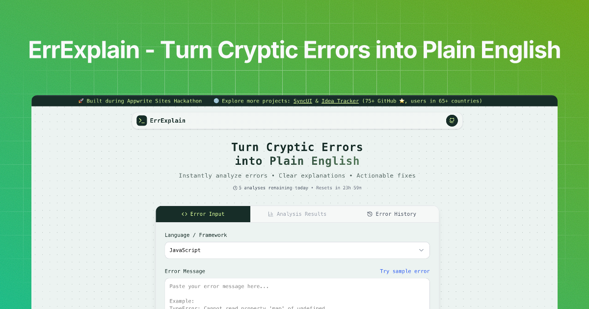

[](https://cloud.appwrite.io/console)

# 🪴 Introducing ErrExplain

**Turn cryptic errors into plain English.**

Instantly analyze programming errors with AI-powered explanations, root cause detection, and actionable solutions.



## 🎯 Problem

Debugging cryptic programming errors is slow and frustrating. Traditional tools like Stack Overflow or general AI chatbots often provide incomplete or unstructured answers. **ErrExplain** fills this gap by providing structured explanations, actionable solutions, and minimal reproducible code for errors across multiple languages.

## ✨ Key Features

- 🔍 **Smart Error Analysis** – Paste any error message and get structured explanations
- 🎯 **Root Cause Detection** – Understand the actual cause of the error
- 🛠️ **Actionable Solutions** – Step-by-step fixes that work
- 💻 **AI-Generated Minimal Code** – Reproduce the exact error with minimal example code
- 🗑️ **Delete Errors from History** – Remove unwanted entries from your dashboard
- 🔐 **Privacy Controls & Auto-Moderation** – Strip API keys, passwords, and optionally mark entries private
- 🌙 **Dark/Light Theme** – Seamless dark mode support
- 💬 **Voting System** – Vote on solutions as helpful or not helpful
- 🔗 **Collaborative Sharing** – Generate shareable links for team debugging
- 📊 **Error History** – Track and analyze debugging patterns with charts
- ⚡ **Rate Limiting** – 5 free analyses per day
- 📱 **Mobile Friendly** – Works on all devices

## 🛠️ Tech Stack

- **Frontend:** Next.js 15+, React 19, Tailwind CSS 4, clsx
- **Backend:** Appwrite Functions, Next.js API Routes, Node.js, node-appwrite
- **Database:** Appwrite Database
- **AI:** Groq (Llama 4 Maverick)
- **Vercel AI SDK:** ai, @ai-sdk/groq
- **Validation:** Zod
- **UI:** Sonner (toasts)
- **Charts:** Recharts
- **Icons:** Lucide React
- **Deployment:** Appwrite Sites

## 🚀 How It Works

1. **Paste** your error message
2. **Analyze** – ErrExplain provides explanation, root causes, and solutions
3. **Reproduce** – Generate minimal example code for the error
4. **Track** – Save and analyze your error history in your dashboard
5. **Share** – Generate shareable links for collaboration

## 📦 Installation & Setup

### Prerequisites

- Node.js 18+
- Appwrite account and project
- Groq API key

### Local Development

```bash
# Clone repository
git clone https://github.com/AbhiVarde/errexplain.git
cd errexplain

# Install dependencies
npm install

# Set up environment variables
cp .env.example .env.local
# Edit .env.local with your credentials

# Run development server
npm run dev
```

Open [http://localhost:3000](http://localhost:3000) to start analyzing errors.

### Environment Variables

```env
# Appwrite
APPWRITE_API_KEY=your_appwrite_api_key
NEXT_PUBLIC_APPWRITE_PROJECT_ID=your_project_id
NEXT_PUBLIC_APPWRITE_ENDPOINT=https://fra.cloud.appwrite.io/v1
NEXT_PUBLIC_APPWRITE_DATABASE_ID=your_database_id
NEXT_PUBLIC_APPWRITE_ERROR_SUBMISSIONS_COLLECTION_ID=your_collection_id
```

### Appwrite Setup

#### 🏗️ Collections

- **error-submissions** – `clientId`, `errorMessage`, `language`, `explanation`, `causes`, `solutions`, `category`, `severity`, `isShared`, `shareId`, `sharedAt`, `exampleCode`, `isPrivate`
- **daily-usage** – `clientId`, `date`, `usageCount`
- **solution-votes** – `shareId`, `solutionIndex`, `voteType`, `userFingerprint`

## 🤝 Contributing

1. Fork the repository
2. Create a feature branch (`git checkout -b feature/amazing-feature`)
3. Commit changes (`git commit -m 'feat: add amazing feature'`)
4. Push to branch (`git push origin feature/amazing-feature`)
5. Open Pull Request

**Development Guidelines:**

- Follow existing code patterns
- Test error scenarios thoroughly
- Maintain responsive design
- Keep commits focused and descriptive

## 💖 Support

**Love ErrExplain? Help me keep building!**

- 💚 **$5 / month – Monthly Supporter** → Recognition in GitHub README
- 🌟 **$19 / month – Monthly Sponsor** → README + Portfolio recognition
- 🚀 **$49 / month – Featured Sponsor** → README + Portfolio + promotion on Sync UI

[👉 Become a Sponsor](https://github.com/sponsors/AbhiVarde)

## License

ErrExplain is licensed under the [MIT License](http://choosealicense.com/licenses/mit/). All rights reserved.

## Authors

ErrExplain is created and maintained by [Abhi Varde](https://www.abhivarde.in/)

---

⭐ **Found this helpful? Give it a star!**
